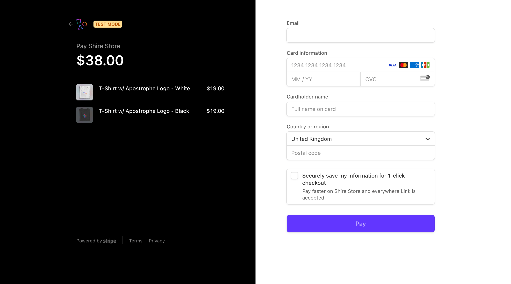
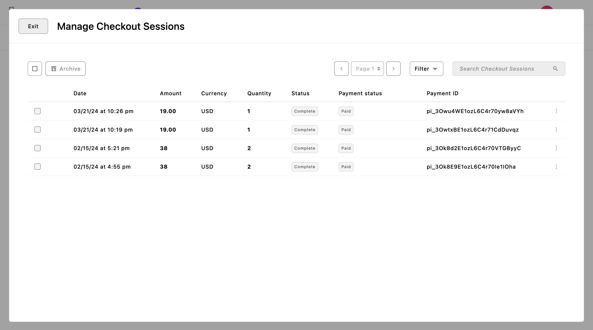
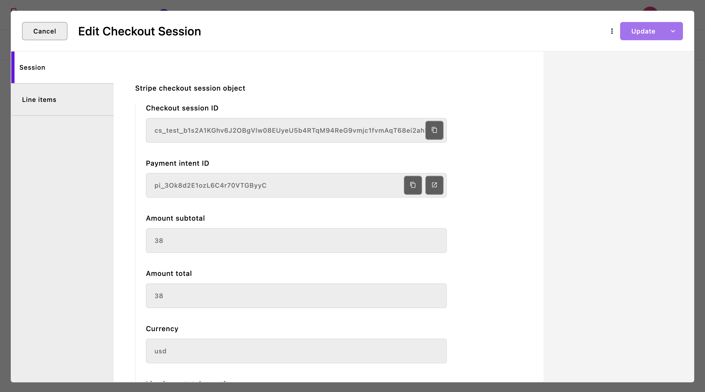
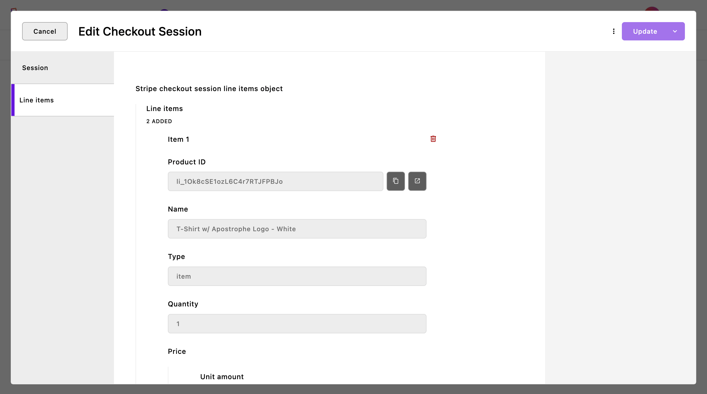

<div align="center">
    <h1>
        Stripe Checkout For Apostrophe 3/4
    </h1>
    <p>
        <a aria-label="Apostrophe logo" href="https://v3.docs.apostrophecms.org">
            
        </a>
        <a aria-label="Personal logo" href="https://stepanjakl.com">
            
        </a>
        <a aria-label="License"
           href="https://github.com/apostrophecms/module-template/blob/main/LICENSE.md">
            
        </a>
    </p>
</div>

This module adds a custom route to initiate a Stripe Checkout instance and another route triggered by a webhook listener for incoming completed session events and to save it in the database as a piece type that can be easily accessible via the admin UI.

[](./public/images/checkout.png)

<table border="0" style="border-collapse: collapse;">
  <tr>
    <td style="padding-left: 0;"></td>
    <td style="padding: 0;"></td>
    <td style="padding-right: 0;"></td>
  </tr>
</table>

## Installation

Use your preferred package manager to install the module. You'll also need to install the [read-only-field](https://github.com/) package alongside it:

```zsh
npm install stripe-checkout@npm:@stepanjakl/apostrophe-stripe-checkout

npm install read-only-field@npm:@stepanjakl/apostrophe-read-only-field
```

## Examples

**I highly recommend checking out the [stripe-examples](https://github.com/) repository with examples and full configuration that showcases how to set up a full e-commerce store experience.**

## Usage

First, add installed modules to your configuration in the `app.js` root file:

```js
require('apostrophe')({
  shortName: 'project-name',
  modules: {
    'read-only-field': {},
    'stripe-checkout': {},
    'stripe-checkout/session': {}
  }
});
```

Then, set global variables inside the `.env` file. It's important to set the `STRIPE_TEST_MODE` variable to anything other than `false` to enable [test mode](https://docs.stripe.com/test-mode).

```dotenv
PORT='4000'
APOS_BASE_URL='http://localhost:4000'
APOS_RELEASE_ID='a4-boilerplate'
APOS_MONGODB_URI='mongodb://localhost:27017/a4-boilerplate'

STRIPE_KEY='sk_test_xyz'
STRIPE_TEST_MODE='false'
STRIPE_DASHBOARD_BASE_URL='https://dashboard.stripe.com'
STRIPE_WEBHOOK_ENDPOINT_SECRET='whsec_xyz'
```

[Read more on how to create a secret Stripe API key](https://docs.stripe.com/keys#create-api-secret-key)

The webhook signing secret is generated and displayed on the initial output of the `listen` command - more on this below.

### API Routes

The `stripe-checkout` module comes with two custom API routes:

**`'/api/v1/stripe/checkout/sessions/create'`:**

This API route handles POST requests to create a new [Stripe Checkout Session](https://docs.stripe.com/payments/checkout/how-checkout-works). It is a central piece of the module and facilitates initiating payment transactions through Stripe. Here's an example of a request using the Fetch API:

```javascript
const requestOptions = {
  method: 'POST',
  headers: {
    'Accept': 'application/json',
    'Content-Type': 'application/json'
  },
  body: JSON.stringify({
    line_items: [
      {
        price: 'price_test_abc',
        quantity: 2
      },
      {
        price: 'price_test_xyz',
        quantity: 1
      }
    ],
    success_url: 'https://example.com/success',
    cancel_url: 'https://example.com/cancel'
  })
};

fetch('/api/v1/stripe/checkout/sessions/create', requestOptions)
  .then(response => {
    if (!response.ok) {
      throw new Error('Failed to create checkout session');
    }
    return response.json();
  })
  .then(data => {
    // Handle the response data, e.g., redirect to the checkout URL
    const checkoutUrl = data.url;
    console.log('Checkout URL:', checkoutUrl);
    // Example: Redirecting to the checkout URL
    window.location.href = checkoutUrl;
  })
  .catch(error => {
    console.error('Error:', error);
    // Handle errors, e.g., show an error message to the user
  });

```

**`'/api/v1/stripe/checkout/webhook'`**

This API route is used by the local listener to receive asynchronous Stripe events and save the completed checkout session to the database.

Set up event forwarding with the CLI and send all Stripe events to your local webhook endpoint for testing purposes:

```shell
stripe listen --forward-to localhost:5000/api/v1/stripe/checkout/webhook
```

Use the PM2 process manager to run the `listen` command in production:

```shell
pm2 start --name stripe-listener "stripe listen --events checkout.session.completed --forward-to localhost:5000/api/v1/stripe/checkout/webhook"
```

[Read more about the Stripe webhooks](https://docs.stripe.com/webhooks/quickstart)


## Limitations (TODOs)

- Option for one-time payments & Recurring payments
- Create checkout session with more than 99 items
- Checkout session styling and other extra options
